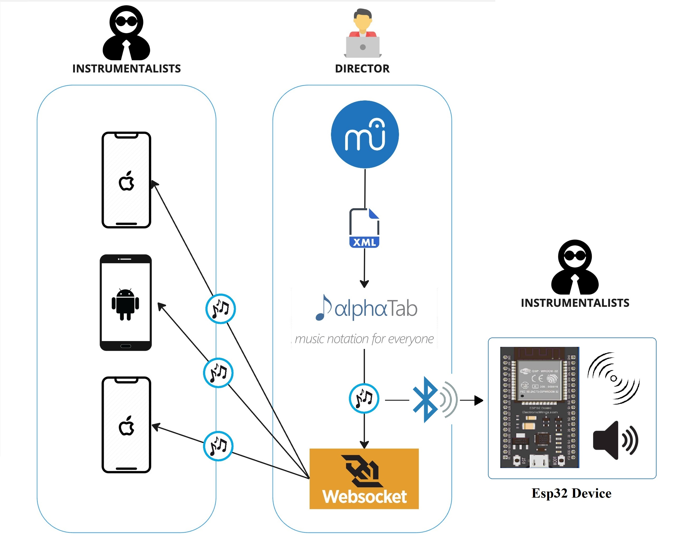
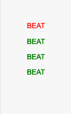
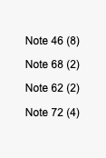

# Notes Sound Generator

## Introduction

Blind people are unable to concurrently "read and play" the score but they have incredible tactile and auditory abilities, this project focuses on playing the time beats and the notes on mobile devices using the vibration functionality.

`Notes Sound Generator` is a [MuseScore 3.x](https://musescore.org) plugin for blind people; it is capable of reading the current score (which can be edited with [MuseScore](https://musescore.org) itself) and extracting, at playing time, the notes and the time signature of the score.

My solution uses the MuseScore plugin development stack, the [Alphatab](https://alphatab.net/) JS library to extract the notes and the time signature from a score, the JavaScript [WebSocket](https://it.javascript.info/websocket) protocol to send data to mobile devices, the JavaScript [WebBluetooth](https://webbluetoothcg.github.io/web-bluetooth/) protocol to send data to the Esp32 prototype device specially designed, which gives audible and tactile feedbacks.

The score is a MusicXML file generated from the developed [MuseScore](https://musescore.org) plugin; this plugin executes the job of exporting the current score (eventually edited with the program itself) in MusicXML format and then passing it to a webpage where an instance of [Alphatab](https://alphatab.net/) is executed. The webpage is able, exploiting the low-level APIs of the library, to play the score and vibrate on mobile devices the time beats and the currently played notes, and also is able to connect via bluetooth with the Esp32 device, which  vibrates for the time beats and actually play the notes.



## Implementation details

In the implementation, the `playing of the time beats` is communicated by descriptive text, points and vibration; text and points are colored in red for the first beat of a bar, and in green for the other beats.




The `current played notes` are communicated by descriptive text which indicates the [MIDI note number](https://www.inspiredacoustics.com/en/MIDI_note_numbers_and_center_frequencies) and the duration.



### MuseScore plugin side

A `partial` portion of the `plugin` code is shown below; it emphasizes its behavior.

When the plugin is run, it `saves` the current `score` in a MusicXML file named `'new-exported.musicxml'` in the `same folder` of the [AlphaTab](https://github.com/CoderLine/alphaTab) instance, and then opens a new `web browser page` with the URL of the [AlphaTab](https://github.com/CoderLine/alphaTab) instance by specifying the parameter `filename`.

```js
function openGenerator(filePath, filename) {
  var newFilePath = filePath + "/src/webpage/" + filename;
  if (!writeScore(curScore, newFilePath, "musicxml")) {
    alert.text = "Cannot export the current score, try again.";
    alert.open();
    return;
  }
  Qt.openUrlExternally("http://localhost:8000?filename=" + filename);
  Qt.quit();
}

onRun: {
  var filename = "new-exported.musicxml";
  openGenerator(filePath, filename);
}
```

### Webpage side

#### Library initialization

The library is initialized by setting the `master volume` to zero in order to avoid the sound playing of the score, and the `file` parameter is set to the URL param of the page if it is specified. This parameter will be set from the [MuseScore](https://musescore.org) plugin with the filename of the file exported from itself.
Two WebSockets are opened in order to send the beat and notes infos to the mobile devices.
Two buttons are setuped for the connection and disconnection via bluetooth, and six variables are defined to handle the bluetooth device and specs.

```js
var timeWebSocket = new WebSocket("ws://localhost:8080/time");
var notesWebSocket = new WebSocket("ws://localhost:8080/notes");
const urlParams = new URLSearchParams(window.location.search);
const urlFileName = urlParams.get("filename");
const settings = {
  file: urlFileName ?? "/file.musicxml",
  player: {
    enablePlayer: true,
    enableCursor: true,
    enableUserInteraction: true,
    soundFont: "/dist/soundfont/sonivox.sf2",
    scrollElement: wrapper.querySelector(".at-viewport"),
  },
};
let api = new alphaTab.AlphaTabApi(main, settings);
api.masterVolume = 0;


const connectButton = document.querySelector(".connect");
const disconnectButton = document.querySelector(".disconnect");

var bleServer;
var bleServiceFound;

var deviceName ='ESP32';
var bleService = '19b10000-e8f2-537e-4f6c-d104768a1214';
var ledCharacteristic = '19b10002-e8f2-537e-4f6c-d104768a1214';
var notesCharacteristic = '39114440-f153-414b-9ca8-cd739acad81c';

connectButton.addEventListener(
    "click", (event) => {
    if (isWebBluetoothEnabled()){
        connectToDevice();
    }
  });

disconnectButton.addEventListener('click', disconnectDevice);
```

#### The `scoreLoaded` event

This event is fired every time a score is loaded. When it's fired, the `createMetronome` function is called which is responsible for building the `timeSignaturePauses` array that is used to play the time signature `beats`.

```js
api.scoreLoaded.on((score) => {
  trackList.innerHTML = "";
  score.tracks.forEach((track) => {
    trackList.appendChild(createTrackItem(track));
  });
  createMetronome(score);
});
```

#### The `createMetronome` function

This function creates the `timeSignaturePauses` array which is used to play the time signature `beats`. It iterates over the score's bars and calculates the `wait time after a beat` is played, by using the `tempoAutomation` value of a bar. The function also determines if the beat is the first beat in the bar.

```js
function createMetronome(score) {
  let tempoAutomation = 0;
  score.masterBars.forEach((bar) => {
    if (
      bar.tempoAutomation != null &&
      tempoAutomation != bar.tempoAutomation.value
    ) {
      tempoAutomation = bar.tempoAutomation.value;
    }
    let barDuration =
      parseFloat(60 / parseInt(tempoAutomation)) *
      parseInt(bar.timeSignatureNumerator);
    if (parseInt(bar.timeSignatureNumerator) == 0) return;
    let beatsWaitTime = barDuration / parseInt(bar.timeSignatureNumerator);
    for (
      let index = 1;
      index <= parseInt(bar.timeSignatureNumerator);
      index++
    ) {
      if (index == 1) {
        timeSignaturePauses.push({
          waitTime: beatsWaitTime,
          isFirstBeat: true,
        });
      } else {
        timeSignaturePauses.push({
          waitTime: beatsWaitTime,
          isFirstBeat: false,
        });
      }
    }
  });
}
```

#### The `play/pause` event

This event is fired every time the user clicks on the `play` or `pause` buttons.

When the `play` is fired, a new `metronomeWorker` [Web Worker](https://developer.mozilla.org/en-US/docs/Web/API/Web_Workers_API/Using_web_workers) is started which is responsible for sending the `beat` to be played and waiting for the `pause` time indicated in the `timeSignaturePauses` array. The playing of a beat is fired through the `metronomeWorker.onmessage` callback and the `timeSignaturePauses` array is sent to the [Web Worker](https://developer.mozilla.org/en-US/docs/Web/API/Web_Workers_API/Using_web_workers) via the `metronomeWorker.postMessage` function. When the playing of a beat is fired, a message via the WebSocket is sent to the mobile devices, and a message via WebBluetooth is sent to the Esp32 device connected.

When the `pause` is fired, the previously `metronomeWorker` [Web Worker](https://developer.mozilla.org/en-US/docs/Web/API/Web_Workers_API/Using_web_workers) started, is terminated, and a message via WebBluetooth is sent to the Esp32 device to stop the sound.

```js
playPause.onclick = (e) => {
  if (e.target.classList.contains("disabled")) {
    return;
  }
  if (e.target.classList.contains("fa-play")) {
    let currentBarIndex = getCurrentBarIndex(api.tickPosition);
    api.tickPosition = api.score.masterBars[currentBarIndex].start;
    metronomeWorker = new Worker("/js/metronomeWorker.js");
    beatLogger.innerHTML = "";
    metronomeWorker.postMessage({
      startIndex: currentBarIndex,
      pauses: timeSignaturePauses,
    });
    metronomeWorker.onmessage = function (message) {
      if (timeWebSocket.readyState != 1) return;
      if (message.data.isFirstBeat) {
        beatLogger.innerHTML = '<p style="color: green;">BEAT</p>';
        highlightBeat("green");
        writeOnCharacteristic(1);
      } else {
        beatLogger.innerHTML += '<p style="color: red;">BEAT</p>';
        highlightBeat("red");
        writeOnCharacteristic(1);
      }
      timeWebSocket.send(
        JSON.stringify({ isFirstBeat: message.data.isFirstBeat })
      );
      beatLogger.scrollTo(0, beatLogger.scrollHeight);
    };
    api.playPause();
  } else if (e.target.classList.contains("fa-pause")) {
    writeNotesCharacteristic(0);
    writeOnCharacteristic(0);
    api.playPause();
    noteLogger.innerHTML = "";
    beatLogger.innerHTML = "";
    metronomeWorker.terminate();
  }
};
```

#### The `metronomeWorker` [Web Worker](https://developer.mozilla.org/en-US/docs/Web/API/Web_Workers_API/Using_web_workers)

Every time that the worker is launched, it iterates over the `timeSignaturePauses` array by sending the `beat` message and then waiting for the `waitTime` specified in the current element, until the array is entirely consumer or the [Web Worker](https://developer.mozilla.org/en-US/docs/Web/API/Web_Workers_API/Using_web_workers) is terminated.

```js
{
  function sleep(delay) {
    var start = new Date().getTime();
    while (new Date().getTime() < start + delay);
  }

  self.onmessage = function (message) {
    let timeSignaturePauses = message.data.pauses;
    let startIndex = message.data.startIndex;
    for (let index = startIndex; index < timeSignaturePauses.length; index++) {
      const element = timeSignaturePauses[index];
      self.postMessage(element);
      sleep(element.waitTime * 1000);
    }
  };
}
```

#### The `activeBeatsChanged` event

This event is fired every time a note (or a group of notes) in the score is played. When it's fired, a message via the WebSocket is sent to the mobile devices, and a message is sent to the Esp32 device via WebBluetooth after the conversion from midi to frequency with the function `convertMidiToFrequency`;  the DOM element `noteLogger` content is replaced with the description of the current notes played; the notes are extracted from the `activeBeats` variable in the `args` parameter.

```js
const noteLogger = document.getElementById("note-logger");
api.activeBeatsChanged.on((args) => {
  noteLogger.innerHTML = "";
  for (let index = 0; index < args.activeBeats.length; index++) {
    const duration = args.activeBeats[index].duration;
    const noteValues = Array.from(
      args.activeBeats[index].noteValueLookup.keys()
    );

    if(index == 0){
      let temp = convertMidiToFrequency(noteValues[0]);
      writeNotesCharacteristic(temp);
    }

    let i = 0;
    for (i = 0; i < noteValues.length; i++) {
      noteLogger.innerHTML +=
        '<p style="text-align: center;">Note ' +
        noteValues[i] +
        " (" +
        duration +
        ")</p>";
    }
    noteLogger.scrollTo(0, noteLogger.scrollHeight);
  }
  if (notesWebSocket.readyState != 1) return;
  notesWebSocket.send(JSON.stringify({ data: noteLogger.innerHTML }));
});
```

### WebSocket side

#### The `onOpen` function

Every time a `new client` opens the connection to the WebSocket, the server attaches the connection to the respective clients' `array` identified by the connection `path` specified.

```php
public function onOpen(ConnectionInterface $conn)
{
    $request = $conn->httpRequest;
    if ($request->getUri()->getPath() === '/time') {
        $this->timeClients->attach($conn);
        echo "New connection to time channel: {$conn->resourceId}\n";
    }
    if ($request->getUri()->getPath() === '/notes') {
        $this->notesClients->attach($conn);
        echo "New connection to notes channel: {$conn->resourceId}\n";
    }
}
```

#### The `onMessage` function

Every time a `client` sends a message to the WebSocket server, it broadcasts the message to the other clients connected to the same channel identified by the connection `path` specified.

```php
public function onMessage(ConnectionInterface $from, $msg)
{
    $request = $from->httpRequest;
    if ($request->getUri()->getPath() === '/time') {
        foreach ($this->timeClients as $client) {
            if ($from !== $client) {
                $client->send($msg);
            }
        }
    }
    if ($request->getUri()->getPath() === '/notes') {
        foreach ($this->notesClients as $client) {
            if ($from !== $client) {
                $client->send($msg);
            }
        }
    }
}
```
### WebBluetooth side

#### The `connectToDevice` function

When the client clicks on the connection button a small window will pop-up where only the Esp32 devices will be available for the connection. Once clicked, the function establish the connection and search the services offered by the device, enabling the `writeOn` functions, allowing to send message to the device.  

```php
function connectToDevice(){
  console.log('Initializing Bluetooth...');
  navigator.bluetooth
      .requestDevice({
          filters: [{name: deviceName}],optionalServices: [bleService]})
      .then(device => 
                    {
                      console.log('Device Selected:', device.name);
                      device.addEventListener('gattservicedisconnected', 
                                              onDisconnected);
                      return device.gatt.connect();
                    })
      .then(gatt =>
                  {
                    bleServer = gatt;
                    console.log("Connected to GATT Server");
                    return bleServer.getPrimaryService(bleService);
                  })
      .then(service => 
                      {
                        bleServiceFound = service;
                        console.log("Service discovered:", service.uuid);
                        return service.getCharacteristic(ledCharacteristic);
                      })
      .catch(error => {
        console.log('Error: ', error);
        window.alert("Errore nella connessione!")
      })
}
```
#### The `disconnectDevice` and `onDisconnected` functions

When the device is connected via bluetooth to the wep page, automatically the `onDisconnected` is assigned to the device, so as it will handle the disconnection by error itself. Instead the `disconnectDevice` is used to force di disconnection by clicking the disconnect button. Both the function interrupt the bluetooth connectionts and stop the wep page score execution.

```php
function onDisconnected(event){
  console.log('Device Disconnected:', event.target.device.name);
  api.playPause();
  noteLogger.innerHTML = "";
  beatLogger.innerHTML = "";
  metronomeWorker.terminate();
  connectToDevice();
}

function disconnectDevice() {
  console.log("Disconnect Device.");
  if (bleServer && bleServer.connected) {
    console.log("Device Disconnected"); 
    api.playPause();
    noteLogger.innerHTML = "";
    beatLogger.innerHTML = "";
    metronomeWorker.terminate(); 
    return bleServer.disconnect();   
  } else {
      console.error("Bluetooth is not connected.");
      window.alert("Bluetooth is not connected.")
  }
}
```

#### The `writeOnCharacteristic` and `writeNotesCharacteristic` functions

Every time the web page is parsing the time beats and notes these two function are called. Both check the connection, search the specific service to write on, parse the data and send the beats and the frequency of the note to play.

```php
function writeOnCharacteristic(value){
  if (bleServer && bleServer.connected) {
      bleServiceFound.getCharacteristic(ledCharacteristic)
      .then(characteristic => {
                                const data = new Uint8Array([value]);
                                console.log(getDateTime() + " LED value: " + data);
                                return characteristic.writeValue(data);
                              })
      .catch(error => {
                        console.error("Error writing to the LED characteristic: ", error);
                      });
  } else {
          console.error ("Bluetooth is not connected. Cannot write to characteristic.")
          window.alert("Bluetooth is not connected. Cannot write to characteristic. \n Connect to BLE first!")
  }
}

//Write notesCharacteristic
function writeNotesCharacteristic(midi){
  if (bleServer && bleServer.connected) {
      bleServiceFound.getCharacteristic(notesCharacteristic)
      .then(characteristic => {
                                const data = new Uint16Array([midi]);
                                console.log(getDateTime() + " DATA value: " + data);
                                return characteristic.writeValue(data);
                              })
      .catch(error => {
                        console.error("Error writing to the Notes characteristic: ", error);
                      });
  } else {
          console.error ("Bluetooth is not connected. Cannot write to characteristic.")
          window.alert("Bluetooth is not connected. Cannot write to characteristic. \n Connect to BLE first!")
  }
}
```

### Mobile App side

#### The connections to WebSocket

On app `startup`, the WebSocket connections are created.

```dart
final timeChannel = IOWebSocketChannel.connect('ws://YOUR_LOCAL_MACHINE_IP:8080/time');
final notesChannel = IOWebSocketChannel.connect('ws://YOUR_LOCAL_MACHINE_IP:8080/notes');
```

#### The timeChannel StreamBuilder

In the `build` method of the main widget, a new `StreamBuilder` is created for the `timeChannel` connection; the `StreamBuilder` widget executes the `builder` function instructions when receiving a `new message` on the WebSocket.

It vibrates the mobile device and prints on the screen the beats, using a `ListView` starting from the `beats` elements `List`, which is emptied when the first beat of the bar is received.

```dart
StreamBuilder(
  stream: timeChannel.stream,
  builder: (context, snapshot) {
    if (!snapshot.hasData) {
      return const Center(child: CircularProgressIndicator());
    }
    final message = jsonDecode(snapshot.data);
    HapticFeedback.heavyImpact();
    if (message["isFirstBeat"]) beats = [];
    beats.add(message["isFirstBeat"]);
    return Expanded(
      flex: 1,
      child: Align(
        alignment: Alignment.center,
        child: ListView.builder(
          scrollDirection: Axis.horizontal,
          itemBuilder: (context, index) {
            return Center(
              child: Icon(
                Icons.circle,
                size: 30,
                color: beats[index] ? Colors.green : Colors.red,
              ),
            );
          },
          itemCount: beats.length,
        ),
      ),
    );
  },
)
```

#### The notesChannel StreamBuilder

In the `build` method of the main widget, a new `StreamBuilder` is created for the `notesChannel` connection; the `StreamBuilder` widget executes the `builder` function instructions when receiving a `new message` on the WebSocket.

It prints on the screen the notes contained in the WebSocket message.

```dart
StreamBuilder(
  stream: notesChannel.stream,
  builder: (context, snapshot) {
    if (!snapshot.hasData) {
      return const Center(child: CircularProgressIndicator());
    }
    final message = jsonDecode(snapshot.data);
    return Expanded(
      flex: 5,
      child: Html(data: message["data"]),
    );
  },
)
```
### Esp32 side

The Esp32 device's firmware allows it to become a server and provide services, in this case the services are two: one to recive the time beats and one for the notes. The device, once connected, will be always listening the calls from the web page, handling the datas received and giving tactile and sound feedback.

#### Library initialization and global variables
Every library utilized for the bluetooth connection needs to be included, then there is one for the Dac module, used to allow to convert the digital frequency of the notes to actual sound, and one for the Ticker, used to handle timers.
Every global variable needs to be difened in order to handle the connection. Then we create the object for the Dac module and the timers, and assign the working pins of the Esp32. The `current_note` variable will be always modifed by the Dac module in order to play the current note, and we difene the identificator for the services by assigning them an [UUID](https://it.wikipedia.org/wiki/Universally_unique_identifier). 
```c
#include <Ticker.h>
#include <BLEDevice.h>
#include <BLEServer.h>
#include <BLEUtils.h>
#include <BLE2902.h>
#include <DacESP32.h>

//Setup
BLEServer* pServer = NULL;
BLECharacteristic* pSensorCharacteristic = NULL;
BLECharacteristic* pLedCharacteristic = NULL;
BLECharacteristic* pNotesCharacteristic = NULL;
bool deviceConnected = false;
bool oldDeviceConnected = false;
uint32_t value = 0;

// Create DAC object
DacESP32 dac1(GPIO_NUM_25);
Ticker tickNotes;
Ticker tick;

// Use the appropriate GPIO pin for your setup
const int buzzPin = 32; // Dac pin
const int ledGreenPin = 5; // Led pin

int current_note = 0;

#define SERVICE_UUID        "19b10000-e8f2-537e-4f6c-d104768a1214"
#define LED_CHARACTERISTIC_UUID "19b10002-e8f2-537e-4f6c-d104768a1214"
#define NOTES_CHARACTERISTIC_UUID "39114440-f153-414b-9ca8-cd739acad81c"
```
#### The `setup()` and `loop()` functions
The `setup` function is launched when the device is turned on, setupping the specs of the device. The `loop` function is called every tick of the internal clock of the device, and it's used to update the status of the device and the `curren_note` variable to play.

```c
void setup() {
  Serial.begin(115200);
  pinMode(buzzPin, OUTPUT);
  pinMode(ledGreenPin, OUTPUT);
  dac1.enable();

// Create the BLE Device
  BLEDevice::init("ESP32");

// Create the BLE Server
  pServer = BLEDevice::createServer();
  pServer->setCallbacks(new MyServerCallbacks());

// Create the BLE Service
  BLEService *pService = pServer->createService(SERVICE_UUID);

// Create the ON button Characteristic
  pLedCharacteristic = pService->createCharacteristic(
                      LED_CHARACTERISTIC_UUID,
                      BLECharacteristic::PROPERTY_WRITE_NR  
                    );

// Create the Notes Characteristic
  pNotesCharacteristic = pService->createCharacteristic(
                      NOTES_CHARACTERISTIC_UUID,
                      BLECharacteristic::PROPERTY_WRITE_NR  
                    );

// Register the callback for the ON button characteristic
  pLedCharacteristic->setCallbacks(new MyCharacteristicCallbacks());
// Register the callback for the NOTES characteristic
  pNotesCharacteristic->setCallbacks(new CharacteristicCallbacks());


// Start the service
  pService->start();

// Start advertising
  BLEAdvertising *pAdvertising = BLEDevice::getAdvertising();
  pAdvertising->addServiceUUID(SERVICE_UUID);
  pAdvertising->setScanResponse(false);
  pAdvertising->setMinPreferred(0x0);  // set value to 0x00 to not advertise this parameter
  BLEDevice::startAdvertising();
  Serial.println("Waiting a client connection to notify...");
}

void loop() {
  if (!deviceConnected && oldDeviceConnected) {
    Serial.println("Device disconnected.");
    digitalWrite(ledGreenPin, LOW);
    delay(500); // give the bluetooth stack the chance to get things ready
    pServer->startAdvertising(); // restart advertising
    Serial.println("Start advertising");
    oldDeviceConnected = deviceConnected;
  }
  // connecting
  if (deviceConnected && !oldDeviceConnected) {
    // do stuff here on connecting
    oldDeviceConnected = deviceConnected;
    digitalWrite(ledGreenPin, HIGH);
    Serial.println("Device Connected");
  }
  dac1.outputCW(current_note);
}
```
#### The `buzzBeat` and `Dac` functions
The `onWrite` functions are called when the web page send messages to the device, if the message is the time beat it will activate the service dedicated to the beat, instead if the message is the note to play it will activate the service dedicated to the notes.

```c
void functionDac(int firstValue){
  dac1.enable();
  dac1.outputCW(firstValue);
tickNotes.once(3, [](){
    dac1.disable();
  });
}

void buzzBeat() {
  digitalWrite(buzzPin, HIGH);
  tick.once(0.1, [](){
    digitalWrite(buzzPin,LOW);
  });
}

class CharacteristicCallbacks : public BLECharacteristicCallbacks {
  void onWrite(BLECharacteristic* pNotesCharacteristic) {
    std::string value = pNotesCharacteristic->getValue();

    current_note = static_cast<uint8_t>(value[0]) | (static_cast<uint8_t>(value[1]) << 8);
    
    // Check print
    // Serial.println(firstValue);
    // Serial.println(secondValue);
  }
};

class MyCharacteristicCallbacks : public BLECharacteristicCallbacks {
  void onWrite(BLECharacteristic* pLedCharacteristic) {
    std::string value = pLedCharacteristic->getValue();
    int value_number = static_cast<int>(value[0]);
    if(value_number == 1) {
      // Serial.println("Green");
      buzzBeat();
    }else{
      functionDac(0);
      // Serial.println("Red");
    }
  } 
};
```
## Execution Tutorial

This tutorial shows how to locally deploy and run the project.

- **[Prerequisites](#prerequisites)**
- **[Repository](#repository)**
- **[Build](#build)**
- **[Run on MacOS](#run-on-macos)**
- **[Run on other platforms](#run-on-other-platforms)**


### Prerequisites

- [MuseScore 3](https://musescore.org/download#older-versions)
- [Docker and Docker Compose](https://www.docker.com) (Application containers engine)
- [Flutter Version Management](https://fvm.app/)
- [Android Studio](https://developer.android.com/studio) for building the Android App
- [XCode](https://developer.apple.com/xcode/) for building the iOS App
- The ports `8000` and `8080` free on your local machine
- [Esp32 MCU](https://www.espressif.com/en/products/socs/esp32) for the prototype device, plus a vibration module, an amplifier module, a jack 3.5mm module
- [Arduino IDE](https://www.arduino.cc/en/software) for building the Esp32 device

### Repository

Clone the repository into the `Plugins` folder of [MuseScore 3](https://musescore.org):

```sh
$ cd ~/Documents/Musescore 3/Plugins
$ git clone https://github.com/fabiodant/esp32-prototype-Bluetooth-protocol
```

### Build

- Build the Docker environment:

```sh
$ cd notes-sound-generator
$ docker-compose build
```

- Replace the web socket URL with your local machine IP address in the file `notes-sound-generator/src/mobile_app/lib/main.dart`.

- Set the required Flutter version and install the dependencies:

```sh
$ cd notes-sound-generator/src/mobile_app
$ fvm install 3.7.2
$ fvm use 3.7.2
$ fvm flutter pub get
```

- Build the Android App with Flutter:

```sh
$ cd notes-sound-generator/src/mobile_app
$ fvm flutter build apk
```

The output is located at the path `notes-sound-generator/src/mobile_app/build/app/outputs/flutter-apk/app-release.apk`.

- Build the iOS App with Flutter:

```sh
$ cd notes-sound-generator/src/mobile_app
$ fvm flutter build ipa
```

-Build the Esp32 firmware with the Arduino IDE and flash it on the microchip

-Build the actual prototype device by following the readme guide in the Esp32 folder
### Run on MacOS

```sh
$ chmod +x run.sh
$ ./run.sh
```

- Then, launch the App on your mobile device
- And then, turn on the Esp32 device

### Run on other platforms

In order to execute the plugin you need to do the following steps in order:

- Run the docker container:

```sh
$ cd notes-sound-generator
$ docker-compose up -d
```

- Launch the [MuseScore](https://musescore.org) program
- Then, launch the App on your mobile device
- And then, turn on the Esp32 device

## Contributing

This project welcomes contributions and suggestions. If you use this code, please cite this repository.

## Citation

Credit to [CoderLine](https://github.com/CoderLine): [AlphaTab](https://github.com/CoderLine/alphaTab) is a cross platform music notation and guitar tablature rendering library. You can use alphaTab within your own website or application to load and display music sheets from data sources like Guitar Pro or the built in markup language named alphaTex.
